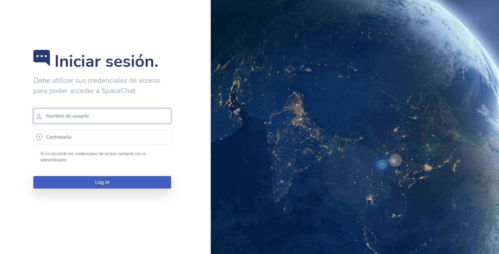
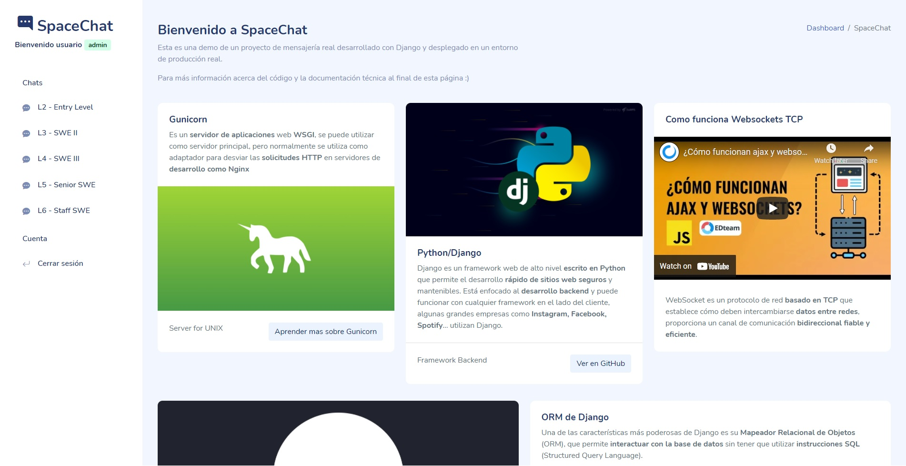
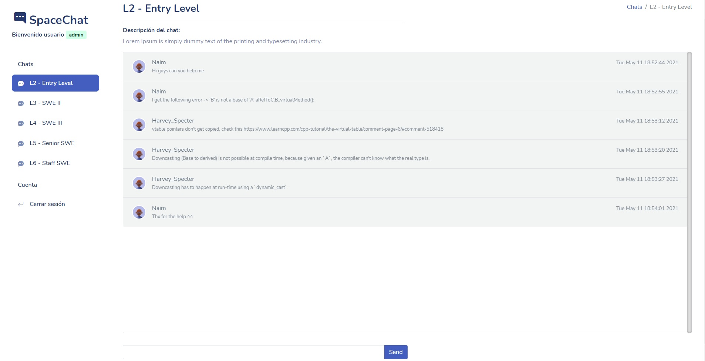

# Django Channels realtime message app 
## Deployed on a Nginx production server with Daphne and Gunicorn over SSL

This project has been inspired by applications such as WhatsApp and Slack, the idea behind this project is to be able to create a minimum viable product of a real-time messaging web application using websockets technology, deployed in a real production environment.

* **Nginx** configured proxy pass to **Daphne ASGI** and **Gunicorn WSGI**.
* Using **Redis Channel** to manage all websockets layers
* Configured `/static/` folder on Nginx to serve all static files like **CSS, Javascript, Images**...
* All connections **HTTP and WebSockets** are working over **TLS/SSL**.
* Using **csrf token** on login page to avoid middleware attacks.
* **Wrapped WebSocket** connection over the module AuthMiddlewareStack.
* Using a pretty GUI to help user to interact with app. 
* You can also manage all chats from **Django Administrator panel**
* Using **JSON** files to make messages perisent in **sqlite database**

## Use

Clone repository and after change the name of the folder to app/:

    $ git clone https://github.com/NgomezKS/Django-message-app-with-Nginx-Daphne-and-Gunciorn

    $ ls 
    Django-message-app-with-Nginx-Daphne-and-Gunciorn/
    
    $ mv Django-message-app-with-Nginx-Daphne-and-Gunciorn/ app

    $ ls 
    app/

Put the .sock and .service files from the `services/` folder in systemd `/etc/systemd/system/` and then run:
     
    $ sudo systemctl daemon-reload

    $ sudo systemctl start gunicorn.socket
    $ sudo systemctl enable gunicorn.socket

    $ sudo systemctl start daphne.service
    $ sudo systemctl enable daphne.service

    $ sudo reboot

You should also put a script in `/etc/init.d` to start Redis after a reboot and also to make sure Daphne and Gunciron are working
   
    #! /bin/bash

    service gunicron start
    service daphne start
    docker run -p 6379:6379 -d redis:6.2.3

    exit 0

Copy the files from `nginx_conf/` to configure the Nginx configuration
   
    $ sudo cp app/nginx_conf/sites-available/spacechat  /etc/nginx/sites-available/spacechat
    $ sudo cp app/nginx_conf/nginx.conf /etc/nginx/

    $ sudo service nginx restart

Now we activate Python virtual enviroment and generate all static files.
   
    $ source app/spacechat/venv/bin/activate
    (venv) $ app/spacechat/manage.py collectstatic

Now you can search https://172.10.10.10/, this is the default user to access.
  
    User: admin 
    Password: p4ssword!

## Some screenshots of the app

### Login page 

### Home page 

### Example chat page 

## To do ideas
* Add support for multiple languages or at least for the most common ones
* Add an complex sistem of levels and permissions
* Add support to send images and videos
* Detect if an user is already logged from another device
* Encrypt messages in the database 
* Also encrypt all messages while they are being processed on the server
* Add private chats between users

Im not going to following developing and maintain this project anymore, if you wanna use it be some purpose be free to dot it.

## Libraries and documentation used 
* [Django](https://www.djangoproject.com/) and
  [Django Channels](https://channels.readthedocs.io/en/stable/).
* [Nginx conf](https://www.nginx.com/)
* [Gunicorn repo](https://github.com/benoitc/gunicorn)
* [Redis](https://pypi.org/project/channels-redis/) 
* [Ddaphne](https://github.com/django/daphne) 
* [Digital Ocean](https://github.com/postcss/postcss/commit/)
* and a lot more ...